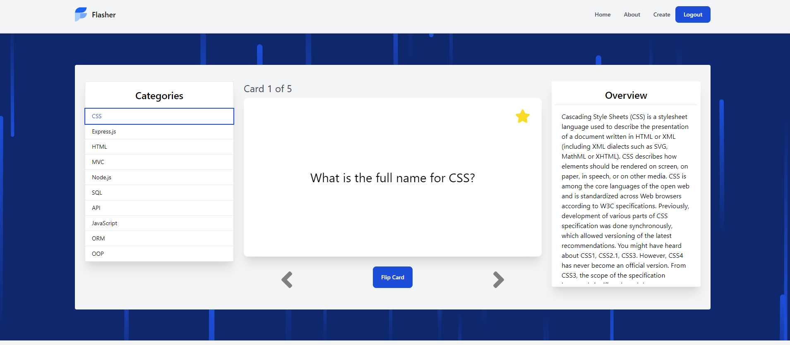
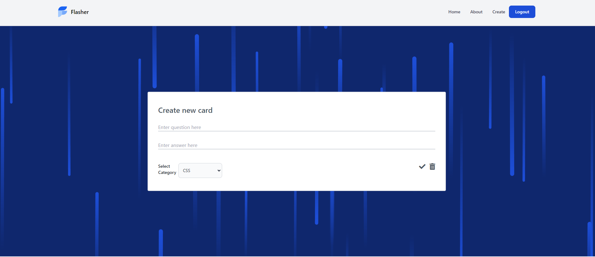

  # Flasher - a bootcamp study companion 

  ## Table of Contents
  
  - [Description](#description)
  - [Design](#design)
  - [Usage](#usage)
  - [Technologies](#technologies)
  - [Questions](#questions)

  ---

  ## Description

  Flasher is a full-stack web application that serves as a flashcard study companion for Bootcamp students. Drawing inspiration from similar products like Quizlet, Flasher allows the user to navigate through decks of flashcards pertaining to their current area of study all the way from basic HTML to the popular Javascript library React. Users also have the ability to create new cards and contribute to the cohort's collective learning experience.

  

  ---

  ## Design

  The intention for Flasher was to keep it simple, but effective. Weekly bootcamp lessons are broken up into decks of flashcards as "Categories". The Categories are created using a Model that contains a name, description and ID. The ID is then used to connect the Categories to the indivual Cards via a foreign key. 

  For future development, we'd like to implment:
  - a feature that allows Users to "favorite" a card, moving it to a User specific deck for further review. 
  - a rating system for the cards
  - the ability to create a new Category("Deck")
  - the ability to share custom Decks with other Users

  ## Usage

  Using Flasher is easy!

  The User begins by selecting a Category to study. When selected, the first card from the Category will be displayed, as well as the Category overview. Users then have the ability to navigate through that "deck" of cards by using the left and right arrows below the card. The card solution or definition is revealed by clicking the "flip card" button.

  

  Once a User has registered with platform, they are able to create new cards to be added to the predetermined Categories. Simply type in a question, answer, and select a Category before hitting the checkmark below the form. Fields can be cleared with the trashcan icon. 
  
  

  ---
  

 ## Technologies 
  - Node.js
  - Express.js 
  - MySql
  - Sequelize
  - Tailwind CSS
  - Anime.js

  ## Questions
  Have any questions? Feel free to reach out to us!
  
  Jacob McCarthy - thejacobmccarthy@gmail.com

